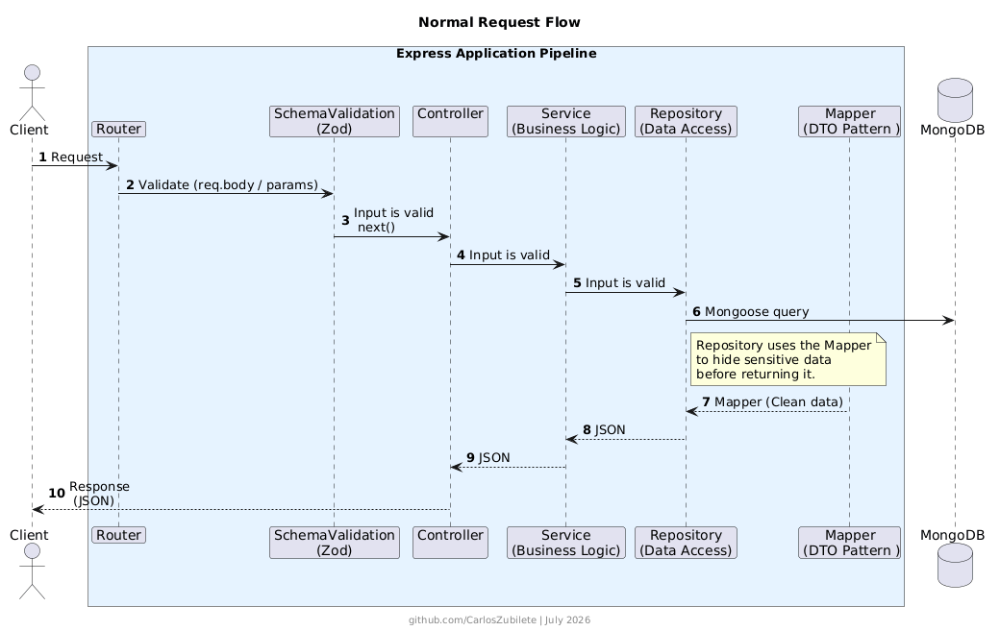
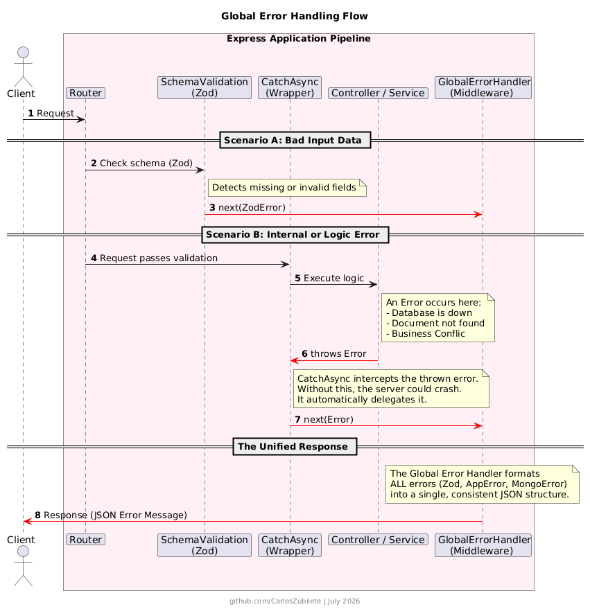

# Express TypeScript API - Layered Architecture

This project is a RESTful API built with Node.js, Express, TypeScript, and MongoDB. It implements a layered architecture inspired by Java/Spring Boot best practices, ensuring clean code, scalability, and maintainability.

## Tech Stack

- **Runtime:** Node.js
- **Framework:** Express.js
- **Language:** TypeScript
- **Database:** MongoDB & Mongoose
- **Validation:** Zod

## Architecture Design

The application follows a strict layered architecture:

1. **Routes:** Define the API endpoints and map them to controllers.
2. **Controllers:** Handle HTTP requests, responses, and delegate logic to services.
3. **Services:** Contain the core business logic of the application.
4. **Repositories:** Manage data access and interact directly with the Mongoose models.

## Error Handling & Validation

- **Global Error Handler:** A centralized middleware that catches all exceptions and formats them into a standardized JSON `ErrorResponse` (similar to `@RestControllerAdvice` in Spring Boot).
- **CatchAsync Wrapper:** A utility function that eliminates the need for `try/catch` blocks in controllers by passing promises to the Next function.
- **Zod Middleware:** Validates incoming request payloads (`req.body`) against predefined schemas before they reach the controller.

## Folder Structure

```text
src/
├── config/        # Environment and DB connections
├── controllers/   # HTTP Layer
├── errors/        # Custom App Exceptions
├── middlewares/   # Express Middlewares (Error Handler, Validator)
├── models/        # Mongoose Schemas & Interfaces
├── repositories/  # Database access layer
├── routes/        # Express Routers
├── schemas/       # Zod Validation Schemas
├── services/      # Business Logic Layer
└── utils/         # Helper functions (CatchAsync)
```


---

## 1. Normal Request Flow (Happy Path)

This diagram illustrates the successful lifecycle of an HTTP request.It shows how incoming data passes through the Zod validation middleware before reaching the Controller. The request then flows down through the Service and Repository layers. 

To ensure data security and maintain a strict separation of concerns, the Repository uses a Mapper to transform the raw Mongoose document into a clean DTO (Data Transfer Object). This pattern hides sensitive information (like passwords or internal IDs) before returning the `200 OK` response to the client.



---

## 2. Global Error Handling Flow

This diagram explains how the application intercepts and standardizes errors to prevent server crashes. It handles two main scenarios:

1. [cite_start]**Validation Errors:** If the client sends invalid data, the Zod middleware detects it immediately and stops the request, forwarding the error to the global handler.
2. [cite_start]**Runtime/Logical Errors:** The `CatchAsync` wrapper acts as a protective shield around the Controller. [cite_start]If an internal exception occurs (e.g., a database failure or a custom `AppError`), `CatchAsync` catches it and delegates it forward.

[cite_start]Ultimately, the `GlobalErrorHandler` centralizes all exceptions and formats them into a single, unified JSON error response (similar to `@RestControllerAdvice` in Spring Boot).



---
