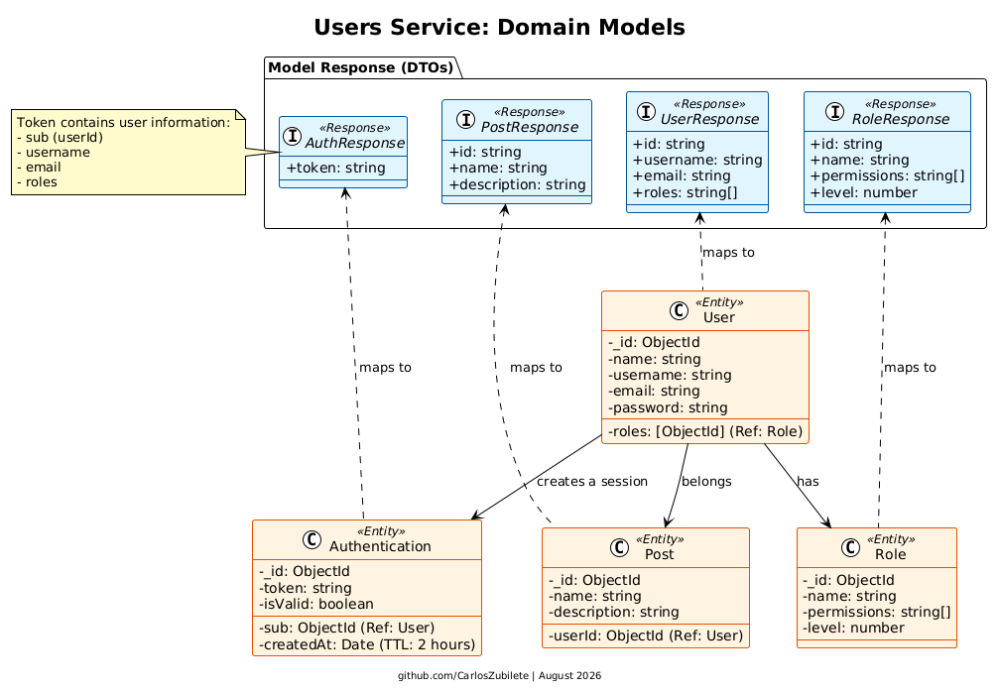

### **Design System: Models**

The application is structured around four primary domain models: **User**, **Role**, **Authentication**, and **Post**. Each model has its own collection in the database, along with corresponding Data Transfer Objects (DTOs) for input validation and output formatting.

---

#### **1. User Domain**

The User collection manages the core identity of the people using the application.

- **Collection (Database):** Stores sensitive credentials securely, including the encrypted password and references to the user's assigned roles.
- **Models Response (DTOs):** \* `UserCreate` / `UserUpdate`: Define the exact fields required to register or modify a user.
    - `UserResponse`: This is critical for security. It filters out the user's password and internal database fields, returning only safe data (like `id`, `email`, `username`, and `roles`).

#### **2. Role Domain**

The Role collection implements a highly secure **Role Hierarchy** system.

- **Collection (Database):** Stores the role name, an array of specific permissions, and a numerical `level`. The `level` weight prevents Privilege Escalation, ensuring that a lower-level user cannot create or assign a role higher than their own.

- **DTOs:** \* `RoleCreate` / `RoleUpdate`: Require the `name`, `permissions`, and priority `level`.
    - `RoleResponse`: Returns the standardized role object to the client.

#### **3. Authentication Domain**

This collection handles session management and JWT (JSON Web Token) security.

- **Collection (Database):** Works as an active session registry. It maps a token to a specific user using the `sub` (subject) field. It includes a TTL (Time-To-Live) index on the `createdAt` field, meaning MongoDB will automatically delete the document after 2 hours (7200 seconds).

- **DTOs:**
    - `AuthLogin`: Expects strictly the `email` and `password` for validation.
    - `AuthResponse`: Returns the generated JWT to the client upon successful login.

#### **4. Post Domain**

The Post collection represents the business logic resources created by authenticated users.

- **Collection (Database):** Stores the `name` and `description` of the post. Crucially, it stores the `userId` of the creator. This ensures that users can only update or delete posts that they own.

- **DTOs:**
    - `PostCreate` / `PostUpdate`: Validates the inputs required to create or modify a post.
    - `PostResponse`: Returns the public details of the post to the frontend, abstracting away internal MongoDB metadata.
