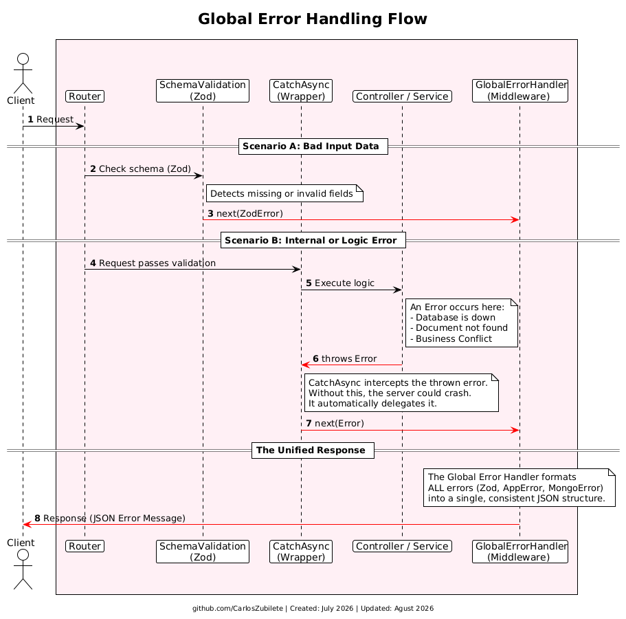

### **2. Global Error Handling Flow**

This diagram explains how the application catches and manages failures without crashing the server, ensuring the client always receives a consistent response format.

---

 

- **Scenario A (Bad Input):** If a user sends incorrect data, Zod detects the invalid fields immediately. It blocks the request from reaching the Controller and sends the error directly to the Global Error Handler.

- **Scenario B (Logic or Database Error):** If an error occurs deeper in the application (like a database disconnection or a missing document), the **CatchAsync** wrapper intercepts it. This acts as a protective shield, delegating the error forward and eliminating the need to write repetitive `try/catch` blocks in every Controller.

- **The Unified Response:** Whether the error came from Zod, Mongoose, or custom business logic, the Global Error Handler catches it at the very end. It formats the error into a single, predictable JSON structure before sending the final response to the client.
