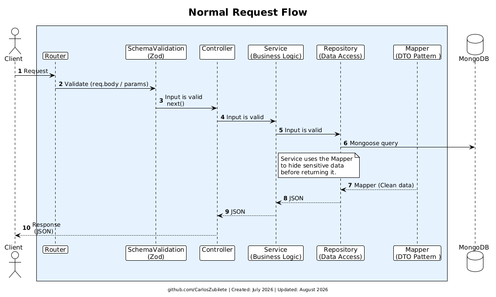

### **1. Normal Request Flow (The Happy Path)**

This diagram illustrates the standard, successful lifecycle of a request as it travels through the application's layers.

---

 

- **Validation First:** The Router immediately sends the incoming request to Zod. If the input is valid, it proceeds to the Controller.
- **Business Logic & Data Access:** The Controller delegates the task to the Service layer, which holds the business rules. The Service then calls the Repository to execute the Mongoose query against the MongoDB database.
- **Data Transfer Object (DTO) Pattern:** Before the data travels back to the user, the system uses a **Mapper**. This ensures that sensitive database information (like passwords or internal MongoDB versions) is filtered out, returning only clean and safe JSON data to the client.
