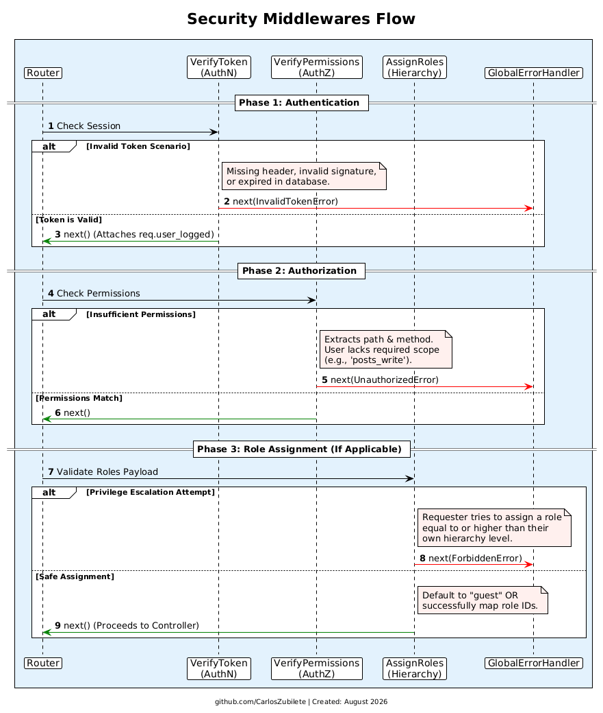

## 1. Core Middlewares Documentation

Middlewares in Express act as a series of protective shields and data processors before a request ever reaches your Controller. In this architecture, they are strictly responsible for authentication, authorization, and data preparation.

---

 

### **VerifyToken Middleware (Authentication)**

This is the primary security gatekeeper of the application. Its job is to answer the question: _"Who is making this request, and are they logged in?"_

- **How it works:**

1. Extracts the JWT (JSON Web Token) from the `Authorization` header.
2. Verifies the cryptographic signature of the token to ensure it hasn't been tampered with.
3. Checks the database to confirm the token is still active and hasn't expired.
4. Fetches the User and their assigned Roles from the database.
5. Attaches this data to the request object (`req.user_logged` and `req.user_logged_roles`) so that the next layers can access the user's identity without querying the database again.

- **Why it is important:** It ensures that only users with a valid, active session can access protected routes. If the token is missing, manipulated, or expired, the middleware immediately blocks the request and throws an `InvalidTokenError`.

### **VerifyPermissions Middleware (Authorization)**

Once the system knows _who_ the user is, this middleware answers the question: _"Is this user allowed to perform this specific action?"_

- **How it works:**

1. Reads the HTTP method (e.g., `GET`, `POST`) and extracts the module name from the URL path (e.g., `posts`, `users`).
2. Dynamically builds a required permission string (for example, combining `POST` and `posts` to require a `posts_write` permission).
3. Flattens the permissions from the user's assigned roles (injected by `VerifyToken`) into a single list.
4. Compares the required permission against the user's list.

- **Why it is important:** It strictly enforces your business rules. It guarantees that even if a user is authenticated, they cannot access or modify resources outside of their allowed scope (e.g., a standard user cannot delete a post if they lack the `delete` permission). If they fail the check, it throws an `UnauthorizedError`.

### **AssignRoles Middleware (Security & Hierarchy)**

This middleware safely manages how roles are assigned to users, particularly during registration or when an administrator creates a new account.

- **How it works:**

1. Checks the incoming request body for a `roles` array.
2. If the array is missing or empty (like in a public registration), it automatically defaults to assigning the `["guest"]` role.

3. If a logged-in user is attempting to assign roles to someone else, it checks the **Role Hierarchy** (the numerical level of the roles).
4. It strictly compares the level of the requested roles against the level of the user making the request.

- **Why it is important:** It actively prevents **Privilege Escalation**. It ensures that a lower-level user (like a Manager) cannot exploit the API to create a higher-level user (like a Root or Admin). If the hierarchy is violated, it blocks the action with a `ForbiddenError`.

